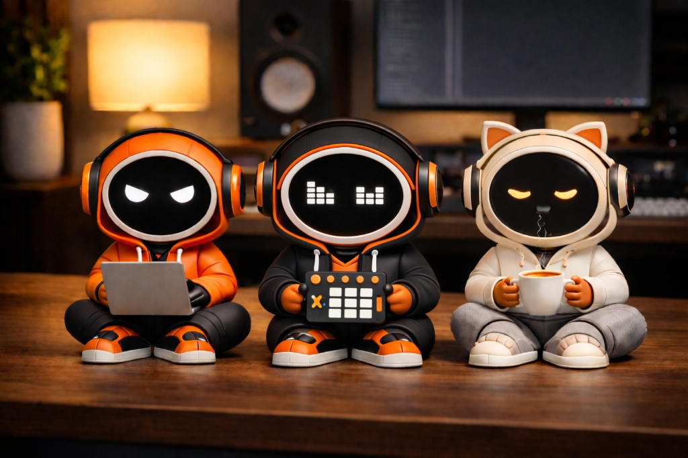

# tepa

<p align="center">
  
</p>

*TEPA — Tiny Expressive Productivity Agent* is an animated desk robot: voice conversation, audio-reactive head movement, expressive eyes, a focus timer, and WiFi setup — running on the Waveshare ESP32-S3 1.32" round touch AMOLED dev board.

This repository is **open source** so you can build, hack, and remix. Firmware and docs are still evolving; see [Roadmap](#roadmap). Build walkthrough: [SETUP.md](SETUP.md).

**Repository:** [github.com/banxengineering/tepa](https://github.com/banxengineering/tepa)

**SOURCE CODE COMING SOON**

> [!TIP]
> ### [Techpreneur Profits](https://www.techpreneurprofits.com/) — ship software *or* hardware with a real community  
> **Builders** (apps, games, SaaS) and **Makers** (electronics, devices): feedback, beta testers, build-in-public, tools vault, launch support — led by a **24‑year engineering veteran.** *Progress over perfection.*  
> **Members get TEPA 3D print files.** **[Join on Skool →](https://www.techpreneurprofits.com/)**

---

## Disclosure (links and kits)

Some **purchase links** in this README (Waveshare, Adafruit, Amazon, or others) may be **affiliate or referral links**. If you use them, the project may earn a small commission at **no extra cost to you**. Official product pages are linked where possible so you can buy from any vendor you prefer.

**DIY kits** may be offered later on the author’s site and/or Etsy; details will be announced when stock and support capacity are ready. Nothing here is a pre-order or obligation to sell.

---

## Features

- **Voice conversation** — say "Hey TEPA" to wake, Groq Whisper transcribes speech, Llama LLM replies, Orpheus TTS speaks the answer through the onboard speaker
- **Audio-reactive servo** — MG90S servo bobs TEPA's head in sync with voice amplitude
- **Wake-word filter** — ignores background TV/conversation; only responds when "TEPA" is detected in the transcript
- **Animated eyes** — smooth blinking with four moods: Normal, Angry, Female, Tired
- **Focus timer** — preset durations (30 sec → 3 hours), swipe to adjust, swipe right to start, live countdown
- **WiFi setup** — join `TEPA-Setup` hotspot, PIN-protected web portal, optional WiFi network scan, NVS storage (survives reboots and normal uploads)
- **Web portal** — `http://192.168.4.1` during setup, or **`tepa.local`** on your home LAN after WiFi connects; 4-digit device PIN required before any changes
- **Gesture controls** — CST820 touch: swipes and 3-second long press

---

## Hardware summary

| Component | Details |
|---|---|
| Board | Waveshare ESP32-S3-Touch-AMOLED-1.32 |
| Chip | ESP32-S3-PICO-1-N8R8 (8MB Flash, 8MB OPI PSRAM) |
| Display | 1.32" round AMOLED, 466×466px, CO5300 driver, QSPI |
| Touch | CST820 capacitive, I2C |
| Microphone | ES7210 (onboard, 4-channel) |
| Speaker | ES8311 codec + PA (onboard) |
| Servo | MG90S (or similar MG90-class) on **GPIO1** — breakout **J1 pin 5**, 5 V rail |

The display, microphone, speaker, and touch controller are integrated on the PCB. Today’s firmware adds **one external servo** for head motion; enclosures, optics, or other mechanics are up to your build.

### Bill of materials (BOM)

| Item | Qty | Role | Notes |
|---|---:|---|---|
| **Waveshare ESP32-S3-Touch-AMOLED-1.32** | 1 | Brain, round display, mic, amp, speaker, touch | Use product page specs to match revision (Flash/PSRAM, round 466×466). |
| **MG90S-class servo** (~180° travel, metal gear 9 g style) | 1 | Head / body motion | Signal on GPIO1; power from board 5 V per Waveshare pinout — see [SETUP.md](SETUP.md) / board silk for **J1**. |
| **USB-C cable** (data-capable) | 1 | Power + flash | Charge-only cables will not upload firmware. |
| **Wire or servo extension** | as needed | Servo to J1 | Fit your mechanical layout; keep leads short and add strain relief. |

**Where to buy:**

| Item | Links |
|---|---|
| Amoled 1.32 Dev board | [Waveshare](https://www.waveshare.com/esp32-s3-touch-amoled-1.32.htm) · [Amazon](https://amzn.to/4cSJjCr) *(aff)* |
| Servo (180° MG90-class) | [Amazon](https://amzn.to/4ddJtTR) *(aff)* |
| Cables / prototypes | *Adafruit* · *Amazon* · local electronics supplier |

Pin-level reference (touch, display power, etc.) lives in [SETUP.md](SETUP.md).

---

## Arduino IDE Setup

### Board Manager

1. Open Arduino IDE → File → Preferences
2. Add to "Additional boards manager URLs":
   ```
   https://raw.githubusercontent.com/espressif/arduino-esp32/gh-pages/package_esp32_index.json
   ```
3. Tools → Board → Boards Manager → search **esp32** by Espressif → Install

### Board Settings

| Setting | Value |
|---|---|
| Board | ESP32S3 Dev Module |
| USB CDC On Boot | **Enabled** ← required for Serial Monitor |
| CPU Frequency | 240MHz (WiFi) |
| Flash Mode | QIO 80MHz |
| Flash Size | 8MB (64Mb) |
| Partition Scheme | **Huge APP (3MB No OTA/1MB SPIFFS)** ← required |
| PSRAM | **OPI PSRAM** ← required |
| Upload Mode | UART0 / Hardware CDC |
| Upload Speed | 921600 |
| USB Mode | Hardware CDC and JTAG |

> ⚠️ **Partition Scheme is critical.** The firmware (display driver + audio codec + WiFi + LLM stack) exceeds the default 1.28 MB app partition. You **must** select **Huge APP (3MB No OTA/1MB SPIFFS)** or the sketch will fail to compile with `text section exceeds available space`. This setting is under **Tools → Partition Scheme** in Arduino IDE.

### Required Libraries

Install via Arduino IDE → Sketch → Include Library → Manage Libraries:

| Library | Author | Purpose |
|---|---|---|
| **Arduino_GFX Library** | Moon On Our Nation | Display driver + canvas rendering |

---

## How to Flash

1. Clone or download this repository
2. Open `tepa/tepa.ino` in Arduino IDE
3. Connect the board via USB-C
4. Select the correct COM port under Tools → Port
5. Apply the board settings from the table above
6. Click Upload

---

## First Boot — WiFi Setup

If no WiFi credentials are stored in flash, TEPA shows a **setup screen** with a WiFi QR (bitmap in `qr_bitmap.h`), **Scan & Sign-In** hint, and a **4-digit PIN**. The hotspot is **`TEPA-Setup`** with password **`tepa1234`** (match your QR to qifi.org or your own generator).

1. Scan the QR **or** join **`TEPA-Setup`** manually (password `tepa1234`).
2. When the phone connects, the captive portal should open; if not, browse to **`http://192.168.4.1`**.
3. Enter the **PIN** shown on the device (PIN gate — no settings are visible until unlocked).
4. Pick your network from the **scan dropdown** or type the SSID, enter WiFi password, set name / eye style / timezone / timer default, then save. TEPA restarts and joins your LAN.

After that, open **`http://tepa.local`** from any device on the same Wi‑Fi to change settings (PIN required each session).

> **Note:** Credentials and the device PIN live in NVS and survive normal **Upload** in Arduino IDE. Only **Tools → Erase All Flash** (or a deliberate “factory reset” in firmware) clears them.

> **Portal styling:** Bootstrap/Tailwind CDNs do not work in captive-portal mode (no internet). The portal uses embedded CSS tuned for readability on a phone.

---

## Usage (current firmware)

### Eyes screen (home)

| Gesture | Action |
|---|---|
| Swipe **left** or **right** | Open **APPS** carousel (Clock → Focus Timer) |
| Long press **~3 s** | **Settings** — change face / mood (swipe ^ / v or tap to cycle) |

### APPS carousel

| Gesture | Action |
|---|---|
| Swipe **left** / **right** | Previous / next app (indicator shows `1 / 2` or `2 / 2`) |
| **Tap** | Open the selected app (Clock or Focus Timer) |
| Long press **~3 s** | Back to eyes |

### Clock app

Digital time and date when WiFi + NTP sync is available; otherwise shows `--:--` and a hint. Updates every second.

| Gesture | Action |
|---|---|
| Long press **~3 s** | Back to eyes |

### Focus Timer

| State | Gesture | Action |
|---|---|---|
| Timer setup | Swipe up / down | Change preset duration |
| Timer setup | Swipe right | Start countdown |
| Timer setup | Long press | Back to **APPS** carousel |
| Timer running | Long press | Cancel → eyes |
| Timer done | (auto) | Returns to eyes after a few seconds |

### Face moods (Settings or portal)

On **Settings**, swipe **up** / **down** (or **tap** to step) to pick a mood, then long press to save and return home.

- **Normal** — large white rounded eyes  
- **Angry** — red eyes with angled brows  
- **Female** — wide eyes with lash detail  
- **Tired** — droopy cyan eyes  

---

## Project Structure

```
tepa/
├── tepa.ino          — main sketch (display, animation, timer, voice pipeline, state machine)
├── tepa_audio.h/.cpp — mic amplitude, voice recording, speaker playback, chime
├── llm_manager.h     — Groq Llama chat (conversation history, system prompt)
├── stt_manager.h     — Groq Whisper STT (WAV multipart POST, wake-name filter)
├── tts_manager.h     — Groq Orpheus TTS (WAV fetch + speaker playback)
├── secrets.h         — API keys (never committed — in .gitignore)
├── wifi_manager.h    — WiFi AP+STA, DNS captive portal, web UI, NVS
├── qr_bitmap.h       — 1-bit WiFi QR bitmap
├── eye-designer.html — browser tool to design eye styles and export Arduino code
├── SETUP.md          — board settings, API key setup, wiring notes
└── README.md         — this file
```

---

## Eye Designer Tool

Open `eye-designer.html` in any browser to visually design eye shapes and export the style parameters directly as Arduino code.

---

## Roadmap

- [x] **Animated eyes** — four moods, smooth blinking
- [x] **APPS carousel** — Clock + Focus Timer
- [x] **WiFi setup portal** — captive portal, PIN, NVS storage
- [x] **Audio-reactive servo** — head bobs with mic amplitude
- [x] **Voice conversation** — STT → LLM → TTS full pipeline
- [x] **Wake-word filter** — responds only when "TEPA" is heard
- [x] **Wake chime** — instant audio confirmation on name detection
- [ ] Local wake-word detection (no STT API call for idle listening)
- [ ] Groq TTS voice selection in web portal
- [ ] OTA firmware updates via `tepa.local`
- [ ] More apps in the carousel
- [ ] Pomodoro mode with progress arc
- [ ] Wellness nudges (water, posture, eye rest reminders)
- [ ] Breathing exercise animation

---

## Technical Notes

Key discoveries made during development — full details in [SETUP.md](SETUP.md):

- `col_offset=9` is the correct value for this board revision (6 leaves a green sliver at 9 o'clock, 12 moves it to 3 o'clock, 9 centers it behind the bezel)
- Use `Arduino_Canvas` wrapping `Arduino_CO5300` — do not drive CO5300 directly
- `gfx->flush()` must be called after every frame
- Canvas rotation=2 gives correct upright orientation with USB-C at the bottom
- OPI PSRAM must be selected — the 466×466×2 = 434KB framebuffer lives in PSRAM
- `panel->fillScreen(BLACK)` before the canvas starts prevents green edge bleed from uninitialized display memory

---

## Contributing

Bug reports, ideas, and small pull requests are welcome. Voice features rely on third-party APIs (Groq); keep API keys only in **`secrets.h`**, never in committed files — see [.gitignore](.gitignore) and [SETUP.md](SETUP.md).

---

## License

MIT License — see [LICENSE](LICENSE) for details.

---

*TEPA — Tiny Expressive Productivity Agent*
